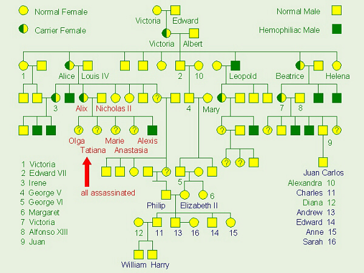

```{r, echo = FALSE, results = "hide"}
include_supplement("hemophilia.jpg", recursive = TRUE)
```

Question
========
What is this image about?
\


Answerlist
----------
* Mendel
* Pedigrees
* Linkage
* Hardy-Weinberg equilibrium
* Autosomal inheritance

Solution
========
This is the pedigree of the European royal families with respect to hemophilia

Answerlist
----------
* False. While this relies on knowledge of Mendel's work, this pic is about inference not experimentsthis pic is about inference not experiments.
* True. Some text here.
* False. Only one trait
* False. Not relevant here.
* False. This trait is X-linked. (Only males affected.)

Meta-information
================
exname: Bio 97 quiz 1
extype: schoice
exsolution: 01000
exshuffle: 3
